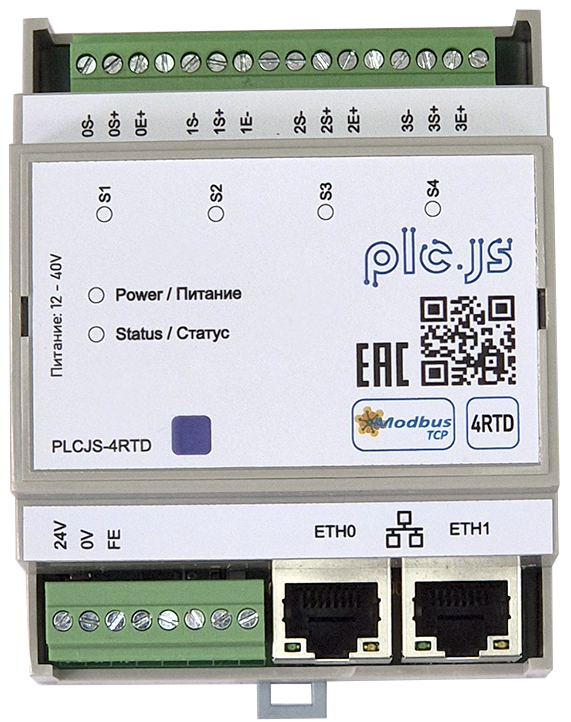
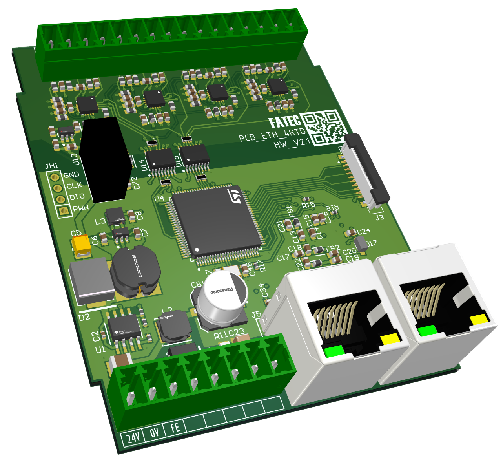

# PLCJS Ethernet 4RTD Resistance Temperature Input Module

<p align="center">
  
</p>
<p align="center"><strong>Module exterior</strong></p>

<p align="center">
  
</p>
<p align="center"><strong>Base printed circuit board</strong></p>

An Ethernet module with four inputs for measuring temperature using resistance
sensors and sending readings to a PLC, SCADA or HMI over **Modbus TCP**.
Sensor type, enable state and smoothing are configured independently for each
channel. Pt1000, Pt100, 50П and 100П sensors, for example, can be connected
at the same time.

- **Model:** PLCJS ETH 4RTD / D4MG
- **Hardware revision:** HW2.1 — STM32F407VGT6, four ADS1220 ADCs
- **Application version:** 2.10 (`0x020A`)
- **Channels:** CH0…CH3; each channel has `S+`, `S−` and `E` terminals.

> All register addresses below are **zero-based Modbus protocol addresses**.
> `HR` means Holding Registers; `IR` means Input Registers. Account for the
> address offset if your SCADA/HMI uses one-based `3xxxx`/`4xxxx` notation.
> The “Кан.1” (Channel 1) label in ModbusTool corresponds to CH0 on the board.

## 1. Purpose and Key Features

The module is intended for distributed temperature monitoring of equipment,
pipelines, tanks and rooms. It measures input signals but does not perform
standalone process control or replace a controller or certified safety device.

- Four separate 24-bit delta-sigma ADS1220 ADCs, one per channel.
- Platinum, copper and nickel RTDs; the complete type-code list is below.
- Three-wire connection with lead-resistance compensation; two-wire connection
  with a jumper and allowance for lead resistance.
- Temperature and resistance as float32, a compact int16 reading, unfiltered
  ADC codes and per-channel diagnostic flags.
- Detection of an open excitation loop, low resistance, negative signal and
  missing ADC response.
- Two external Ethernet ports provided by the built-in KSZ8863 switch.
- Up to four simultaneous Modbus TCP clients.
- Discovery by MAC, IPv4 assignment, static addressing, DHCP and link-local.
- Flash-backed settings, hardware watchdog, settings reset and OTA updates.
- Separate calibration for each channel and gain class, retained across a
  normal factory settings reset.

## 2. Operating Specifications

| Parameter | Value / Notes |
|---|---|
| Measurement channels | 4, CH0…CH3 |
| Primary wiring scheme | Three-wire, two current sources per channel |
| Excitation current | Nominally 500 µA per IDAC; one source current flows through the sensor in the standard circuit |
| Reference resistor | 2 kΩ ±0.1 %, in the return path of both currents |
| ADC conversion | 24-bit, 20 conversions/s per channel, FIR with 50/60 Hz rejection |
| Firmware scan period | 50…5000 ms; factory default 250 ms (`HR100`) |
| Smoothing | Per-channel EMA: off, 1/4, 1/8, 1/16 |
| Resistance measurement modes | 0…200 Ω and 0…2000 Ω |
| Software temperature scales | Platinum −200…+850 °C; copper −180…+200 °C; nickel −60…+250 °C |
| Main reading format | float32, °C or Ω; two registers, high word first |
| Compact temperature format | int16, 0.01 °C per count; use float32 for the full temperature range |
| Factory input configuration | All enabled, Pt1000, standard W100, smoothing off |
| Isolation | A digital isolation barrier separates the measurement circuitry from the MCU; a separate ADC per channel does not imply channel-to-channel isolation |
| Ethernet | KSZ8863, two external ports; the switch forwards traffic while the module is powered |
| Modbus TCP | Default port 502, Unit ID 1; FC03, FC04, FC06, FC16 |
| Simultaneous clients | Up to 4; when all slots are occupied, a new client evicts the one that has been silent the longest |
| Discovery | PLCJS Discovery Protocol (PDP), UDP broadcast, port 20556 |
| Additional diagnostics | MCU die temperature, uptime, version and calibration status |

**Resolution is not accuracy.** A 24-bit ADC and a display showing hundredths
of a degree do not guarantee absolute measurement accuracy. Accuracy depends
on the sensor, leads, contacts, reference resistor, current-source matching
and calibration. A particular sensor's operating range may be narrower than
the software scale.

The electrical full scale is also limited by gain and the allowable voltages
in the analog front end. Consult the documentation for the particular hardware
assembly for supply voltage, environmental limits, dimensions and isolation
test voltage; specifications of another module in the family do not automatically
apply to 4RTD. Board schematic: [PDF in DOC](DOC/PLCJS_ETH_MODULE_4RTD_D4MG_STM32F407VGT6.pdf).

## 3. Sensor Wiring

Follow the channel labels: `0S+ / 0S− / 0E` belong to CH0,
`1S+ / 1S− / 1E` to CH1, and so on. Terminal **E is the excitation-current
return** through the reference resistor, not protective earth (PE) or a shield
terminal. Do not apply an external 24 V supply or a 4–20 mA signal to RTD inputs.

### Three-wire Sensor

```text
S+ ───────────────[ RTD ]─────┬──────── S−
                             └──────── E
```

One lead connects one end of the sensing element to S+. Two separate leads
connect its other end to S− and E; **no additional S−–E jumper is required
at the module**. Identify the paired leads from the sensor documentation,
not from insulation color alone.

Compensation assumes similar resistances in the S+ and S− leads and matched
IDAC currents. Use equal lead lengths and cross-sections and reliable contacts.
Route measurement wiring away from power wiring and interference sources;
connect the shield according to the installation's grounding design.

### Two-wire Sensor or Passive Resistance Standard

```text
S+ ───────────────[ RTD / R ]───────── E
S− ───────────────── jumper ──────── E
```

Connect the sensor between S+ and E and fit an S−–E jumper at the module
terminals. Lead and contact resistances are included in the result with this
connection; three-wire wiring is preferred for accurate measurement.
Measure resistance with a multimeter only after disconnecting the circuit
from the module, with no ADS1220 excitation current applied.

## 4. Quick Start

1. Connect power and Ethernet according to the product schematic, then the sensors.
2. Open the **“Обнаружение” (Discovery)** tab in ModbusTool and select the
   appropriate network adapter. The factory address is link-local
   `169.254.x.y`, not a fixed `.12` address.
3. Find the module by MAC and assign a unique operating address or select DHCP.
   Allow inbound UDP/20556 through the firewall for PDP. For direct link-local
   access, configure suitable addressing/routing on the PC.
4. In **“Онлайн” (Online)**, select the **4RTD** map, module address, port `502`
   and Unit ID `1`. A 500 ms continuous-read period is a useful starting point.
5. Set each channel's type in `HR4…7` using the table below and its enable state
   in `HR8…11`. Write `0` to the enable register of each unused input.
   After a factory reset, all inputs are enabled as Pt1000; unconnected inputs
   will report a fault.
6. Wait for the initial input checks to finish. Read `IR324…327` as well as
   temperature: a reading is usable only with `enabled=1`, `valid=1`, `fault=0`.
7. After configuration, press **SAVE** or write `42405` (`0xA5A5`) to `HR117`.
   Without SAVE, ordinary settings changes are lost on restart.

Example configuration for four different sensors:

| Channel | Sensor | Type Register | Value | Enable Register |
|---|---|---|---|---|
| CH0 | Pt1000 | HR4 | 18 | HR8 = 1 |
| CH1 | 50П | HR5 | 2 | HR9 = 1 |
| CH2 | Pt100 | HR6 | 8 | HR10 = 1 |
| CH3 | 100П | HR7 | 7 | HR11 = 1 |

This is an example, not the factory configuration. Do not select a sensor type
merely because its resistance is similar: Pt100 and 100П have different R(T)
characteristics.

## 5. Sensor Type and Range Selection

### 5.1 Type Codes (`HR4 + ch`)

R0 is the resistance at 0 °C. W100 = R(100 °C)/R0; its standard value is
selected according to the sensor type. Cyrillic М and П in GOST type names
are retained here to match the sensor markings and ModbusTool labels.

| Code | Type | Material / Characteristic | R0, Ω | W100 | Gain Class |
|---|---|---|---:|---:|---:|
| 0 | 50М | Copper, GOST | 50 | 1.4280 | 0 |
| 1 | Cu50 | Copper | 50 | 1.4260 | 0 |
| 2 | 50П | Platinum, GOST | 50 | 1.3910 | 0 |
| 3 | Pt50 | Platinum, IEC 60751 | 50 | 1.3851 | 0 |
| 4 | Ni100 | Nickel, DIN 43760 | 100 | 1.6180 | 1 |
| 5 | 100М | Copper, GOST | 100 | 1.4280 | 1 |
| 6 | Cu100 | Copper | 100 | 1.4260 | 1 |
| 7 | 100П | Platinum, GOST | 100 | 1.3910 | 1 |
| 8 | Pt100 | Platinum, IEC 60751 | 100 | 1.3851 | 1 |
| 9 | Ni500 | Nickel, DIN 43760 | 500 | 1.6180 | 2 |
| 10 | 500М | Copper, GOST | 500 | 1.4280 | 2 |
| 11 | Cu500 | Copper | 500 | 1.4260 | 2 |
| 12 | 500П | Platinum, GOST | 500 | 1.3910 | 2 |
| 13 | Pt500 | Platinum, IEC 60751 | 500 | 1.3851 | 2 |
| 14 | Ni1000 | Nickel, DIN 43760 | 1000 | 1.6180 | 3 |
| 15 | 1000М | Copper, GOST | 1000 | 1.4280 | 3 |
| 16 | Cu1000 | Copper | 1000 | 1.4260 | 3 |
| 17 | 1000П | Platinum, GOST | 1000 | 1.3910 | 3 |
| 18 | Pt1000 | Platinum, IEC 60751 | 1000 | 1.3851 | 3 |
| 19 | R200 | Resistance 0…200 Ω | — | — | 1 |
| 20 | R2k | Resistance 0…2000 Ω | — | — | 4 |

Use `HR12 + ch = 0` for the standard characteristic. For a nonstandard sensor,
set `HR12 + ch = 1` and write W100 × 10000 to `HR16 + ch`
(for example, `13851` for W100 = 1.3851). This configures the sensor
characteristic; it **does not replace electrical channel calibration**.

Platinum uses the Callendar–Van Dusen model, copper a linear model with a
sub-zero correction, and nickel the DIN polynomial. Custom W100 changes α;
the other coefficients of the selected model remain unchanged.
Outside the software scale, temperature conversion clamps the result to the
scale limits. A reading at a limit does not by itself prove correct wiring.

### 5.2 Automatic Gain Selection

| Class | PGA Gain | Calculated ADC Full Scale | Application |
|---|---:|---:|---|
| 0 | 16 | 250 Ω | Sensors with R0 = 50 Ω |
| 1 | 8 | 500 Ω | Sensors with R0 = 100 Ω and R200 |
| 2 | 2 | 2000 Ω | Sensors with R0 = 500 Ω |
| 3 | 1 | 4000 Ω | Sensors with R0 = 1000 Ω |
| 4 | 1 | 4000 Ω | R2k mode |

The class is selected automatically by sensor type. `HR20…23 = 0` is normal
operation; `1…5` force class 0…4 for calibration and last only until restart.
Temperature is not reported (NaN) when a gain class is forced.
Classes 3 and 4 have the same gain but **different calibration slots**.

ADC full scale is not a guaranteed measurement range for every sensor. Allow
headroom below saturation and observe the IDAC and PGA voltage limits.
With a nominal 2 V reference, S+ is approximately `2 V + 0.5 mA × R`;
increasing current or resistance reduces analog supply headroom.

## 6. Reading Updates and Diagnostics

### 6.1 Scan Period and Validity

`HR100` sets how often the firmware reads the ADCs, **not the ADS1220
conversion rate**, which remains 20 SPS. Faster Modbus polling does not
speed up measurement.

- After a channel is enabled, readings are not considered valid until its
  first loop check and settling are complete.
- The firmware switches channels, one at a time, to reference-voltage monitoring
  to detect an open loop. The previous reading and status are held during the
  check and subsequent settling; at the standard 250 ms scan period, the
  checked channel pauses updates for approximately 1 s.
- The repeat-check interval is set to 4 s, but checks run sequentially and are
  tied to the task cycle. This is **not a guarantee that every open circuit
  will be detected within 4 s**; delay depends on the enabled-channel count
  and `HR100`.
- A large `HR100` substantially delays initial readiness, open-loop detection
  and recovery. The `valid` flag is not a timestamp for a new sample.
- Application logic must check network-read success and channel flags.
  Do not treat the last number retained after a communication loss as a
  current measurement.

### 6.2 Smoothing (`HR24 + ch`)

| Value | Mode | EMA Coefficient |
|---|---|---|
| 0 | Off, factory default | — |
| 1 | Weak | 1/4 |
| 2 | Medium | 1/8 |
| 3 | Strong | 1/16 |

The filter operates on calibrated resistance before temperature conversion:
`R = R + α × (R_measured − R)`. Raw resistance `IR316…323` and ADC codes
`IR328…335` remain unfiltered. The EMA is reinitialized after configuration
changes or a fault.

Settling-time estimates: `t63 ≈ T_scan / α`, `t95 ≈ 3 × T_scan / α`.
At 250 ms, weak/medium/strong smoothing takes roughly 3/6/12 s to reach 95 %.
Diagnostic pauses increase the actual time; these estimates are not guaranteed
response times.

### 6.3 Flags and Faults (`IR324 + ch`)

| Field | Meaning |
|---|---|
| bit 0 | Channel enabled (`enabled`) |
| bit 1 | Reading valid (`valid`) |
| bit 2 | Confirmed fault (`fault`) |
| bits 15…8 | Fault code from the table below |

| Code | Meaning | What to Check |
|---|---|---|
| 0 | No confirmed fault | Also check `valid`; the channel may still be settling |
| 1 | Open loop / over-range | All three leads, the jumper for two-wire wiring, and sensor range |
| 2 | Short / resistance too low | Terminal shorts and selected type; the RTD threshold is `R < 0.1 × R0` |
| 3 | ADC does not return the expected configuration | Measurement-side power, SPI and chip selection; board diagnostics |
| 4 | Substantial negative signal | S+/S− order and the E return path; this code does not establish a single specific failure cause |

An open loop is detected when the voltage across RREF drops below approximately
0.4 V, and additionally by positive saturation (`code ≥ 0x7FF000`).
Code 4 corresponds to `code ≤ −0x10000`, approximately −0.78 % of the ADC's
positive full scale. The short-circuit check is disabled in resistance modes
because 0 Ω is a valid input.

Code-based faults are confirmed after three consecutive faulty scans; the last
good reading may be held until confirmation. The loop-monitor verdict is
handled separately. After the signal returns to normal, a settling window
precedes the return of `valid`. Do not infer recovery solely from `fault`
clearing or the LED changing.

### 6.4 LED Indication

**Channel LEDs:**

| Indication | Meaning |
|---|---|
| Off | Channel disabled |
| Solid on | Channel enabled, no confirmed fault; check `valid` for reading readiness |
| Smooth fade in/out | Fault: 1 s fade in → 1 s fade out → 0.5 s dark; total cycle 2.5 s |

**STAT_LED** with `HR101 = 2` (factory mode):

| Indication | Meaning |
|---|---|
| One flash per 3 s cycle | Ethernet link present, no recent Modbus requests |
| Two flashes per 1.5 s cycle | Recent Modbus request; a single request counts, not just a persistent socket |
| Three flashes per 3 s cycle | No link on either external port |
| Five-flash burst | Emergency calibration erase is armed |
| Rapid blinking on an identify command | Identifies the selected module through PDP |

`HR101 = 0` disables normal STAT_LED indication; `1` selects solid on.
Service reset indication takes priority. The bootloader has its own patterns:
in bootloader v1.7, waiting for a command uses a smooth fade in/out with a
1 s period.

## 7. Network and Settings Persistence

| Parameter | Factory Default |
|---|---|
| Network mode (`HR116`) | 2 — link-local |
| Address | `169.254.<mac[4]>.<mac[5]>`, mask `255.255.0.0` |
| Stored static-address fields | `192.168.1.10`, mask `255.255.255.0`, gateway `192.168.1.1` |
| Modbus TCP | Port 502, Unit ID 1 |
| MAC | Locally administered, derived from the STM32's 96-bit UID |

**192.168.1.12** is used on the bench as an assigned 4RTD address; it is not
the firmware's factory address. Each module on a network needs a distinct
IPv4 address. The application and bootloader share the same MAC, but their
current IP settings may differ. Discover the device again by MAC after
entering the bootloader.

`HR116`: `0` — static, `1` — DHCP, `2` — link-local. Execute SAVE after changing
network registers; network settings are applied without a mandatory reboot.
Changing the IP address may interrupt the existing connection.

Ordinary channel settings are applied in RAM. **SAVE (`HR117 = 42405`)**
persists them to Flash together with network settings. Do not write SAVE
cyclically with every poll. Committing calibration is a separate command,
not SAVE.

If communication fails:

- Check power, link, IP, mask, Unit ID and the actual route through the
  intended Ethernet adapter.
- For discovery, check UDP/20556 and the local broadcast segment.
- A VPN/TUN can intercept local traffic, particularly during a cable
  disconnect. A successful TCP socket connection on the PC does not by itself
  prove that the module answered.
- Account for the four-client limit and disconnection of clients silent for
  30 s; reconnect after a transport error.
- Keep Modbus TCP on a trusted network: the protocol does not authenticate
  operators before service-register writes.

## 8. Modbus TCP Register Map

FC03 reads HR, FC04 reads IR, and FC06/FC16 write HR.
Quantities are grouped **by function**, then by CH0…CH3.
Float32 is IEEE-754 in two registers, **high word first**; the int32 ADC code
uses the same word order. For example, CH0 temperature occupies IR300 and IR301.

### 8.1 Channel Settings and Compact Readings

| HR | Access | Purpose |
|---|---|---|
| 0…3 | RO | RTD: temperature ×100 as int16; R200/R2k: 0…32767 scaled to 200/2000 Ω |
| 4…7 | RW | Sensor type code, 0…20 |
| 8…11 | RW | Enable: 0/1 |
| 12…15 | RW | Characteristic: 0 standard, 1 custom W100 |
| 16…19 | RW | W100 ×10000 for the custom characteristic |
| 20…23 | RW | Forced gain class: 0 auto, 1…5 → class 0…4; not persisted |
| 24…27 | RW | Smoothing: 0…3 |

`FC03`, address 0, quantity 28 reads the complete compact block.
In HR0…3, a disabled channel returns `0`; a fault or absence of a valid reading
returns `−32768` (`0x8000`). Other readings are clamped to −32767…32767:
temperatures above +327.67 °C do not fit here, so use IR300…307.
In resistance modes, the compact value is clamped to the mode's scale;
use float32 for a reading in ohms.

### 8.2 Measurements and Status

| IR | Format | Purpose |
|---|---|---|
| 300…307 | float32 ×4 | Temperature, °C |
| 308…315 | float32 ×4 | Calibrated resistance, Ω |
| 316…323 | float32 ×4 | Raw resistance, Ω; used for calibration |
| 324…327 | u16 ×4 | Status flags and fault code |
| 328…335 | int32 ×4 | Signed 24-bit ADC code |
| 336…339 | u16 ×4 | Active gain class, 0…4 |
| 120 / 121 | u16 / u16 | Application version: major / minor (2 / 10) |
| 122 / 123 | u16 / u16 | Uptime in seconds: **low / high** word |
| 125 | u16 | Module identifier `0x04D1` |
| 126 | int16 | MCU temperature, 0.1 °C per count |
| 127 / 128 | u16 / u16 | Calibration lock mask: bits 0…15 / 16…19 |

Temperature is NaN in resistance modes, with a forced calibration gain class,
and on a confirmed fault. NaN is also used for unavailable measurements.
Always check the flags independently of the float32 value. MCU temperature
is an internal diagnostic and is not a substitute for an ambient-temperature sensor.

### 8.3 Global Settings

| HR | Access | Purpose |
|---|---|---|
| 100 | RW | Firmware scan period, 50…5000 ms |
| 101 | RW | STAT_LED: 0 off, 1 on, 2 automatic indication |
| 102 | RW | Modbus Unit ID |
| 103 | RW | Modbus TCP port |
| 104…107 | RW | Four octets of the static IPv4 address |
| 108…111 | RW | Four subnet-mask octets |
| 112…115 | RW | Four gateway octets |
| 116 | RW | Network mode: 0 static / 1 DHCP / 2 link-local |
| 130 | RO | MCU temperature (int16, 0.1 °C), same as IR126 |
| 620…621 | RW | Nominal RREF, float32 in ohms; default 2000.0 |

### 8.4 Service Commands

In ModbusTool, use the buttons in command rows or enter a number manually.
Hex input requires the `0x` prefix; decimal equivalents are listed separately.
Send each command once, not cyclically.

| HR | Command | Hex | Decimal | Action |
|---|---|---|---:|---|
| 117 | SAVE | `0xA5A5` | 42405 | Save ordinary settings |
| 118 | REBOOT | `0xB00B` | 45067 | Restart the application |
| 118 | BOOT | `0xB007` | 45063 | Enter the Ethernet bootloader |
| 118 | KSZ RESET | `0x8863` | 34915 | Reset the switch; temporarily interrupts communication through both ports |
| 119 | FACTORY RESET | `0xDEAD` | 57005 | Reset settings and restart the module |
| 131 | CAL COMMIT | `0xCA00 \| slot` | 51712 + slot | Irreversibly commit calibration slot 0…19 |
| 132 | CAL ERASE ARM | `0xC1A5` | 49573 | Arm the physical-confirmation window for calibration erase |

A normal factory reset **does not erase calibration**, but restores link-local,
enables all channels and selects Pt1000. For a hardware reset of settings,
hold `FACT_RES` during module startup for at least 2 s; service LED indication
accompanies the reset.

## 9. Calibration and Measurement Accuracy

Each channel is calibrated separately for each gain class:
**20 slots in total (4 × 5)**. The model is linear:

```text
R_cal = gain × R_raw + offset
slot = ch × 5 + class
```

Two well-separated points determine gain/offset; a third and further points
allow a linearity check and a least-squares fit. They do not remove systematic
error in the reference standard itself.

Use passive precision resistors, a calibrated resistance box, or measured
standards with known uncertainty. Before using an active RTD simulator, check
its allowable excitation current, wiring and compatibility with the module's
input. Specified resistance **sourcing/simulation** accuracy is not the same
as resistance **measurement** accuracy; agreement at one point is insufficient.

For accurate work, account for leads, contacts, temperature coefficient and
self-heating. With three-wire wiring, both return leads must meet at the
standard; compensation requires similar S+ and S− lead resistances. Do not
mistake the resistance of a two-wire test fixture for a constant module error.

### Coefficients and Preview

Register base: `540 + ch × 20 + class × 4`.

| Offset from Base | Format | Value |
|---|---|---|
| +0…1 | float32 | gain |
| +2…3 | float32 | offset, Ω |

Writing an unlocked slot provides a **live preview in RAM**. First collect
raw readings from `IR316…323` with the correct gain class and `valid=1`,
calculate coefficients and verify an independent check point. Readings are
held during loop diagnostics: reading the same number again does not necessarily
provide a new independent sample.

Do not change RREF after calibration: it changes the conversion of raw ADC
codes and invalidates the previously calculated coefficients.

### Commit and Emergency Erase

1. After verification, write `51712 + slot` to `HR131` only with deliberate
   operator approval: the slot is programmed to Flash **once** and locked.
2. Check the lock via `IR127/128`, bit `ch × 5 + class`.
3. A second commit or a coefficient change in a locked slot is rejected with
   `ILLEGAL DATA VALUE`. SAVE does not replace CAL COMMIT.

Emergency erase removes **all 20 slots**, not a single selected slot:
write `49573` to `HR132`, then hold `FACT_RES` for approximately 3 s within
30 s. The module erases calibration and restarts. Neutral coefficients after
erase are gain = 1, offset = 0. Arming over the network alone or pressing the
button alone is insufficient. Ordinary SAVE and FACTORY RESET do not erase
the calibration sector.

Tools: [tools/README.md](tools/README.md), `tools/calibrate.mjs`
(Node.js 18+) and `tools/calibrate.py` (Python 3.8+). The `.12` address below
is an example for a module that has already been assigned that static address:

```powershell
node tools/calibrate.mjs status --ip 192.168.1.12
node tools/calibrate.mjs calibrate --ch 0 --class 3 --ip 192.168.1.12
python tools/calibrate.py set --ch 0 --type Pt1000 --enable 1 --ip 192.168.1.12
```

## 10. Firmware Updates

HW2.1 requires the **4rtd** bootloader variant and the **ADS1220** application.
HW1.x firmware (MAX31865 + ADG849) is incompatible; the historical version is
preserved under the `hw1.1-last` tag.

For a normal OTA update through ModbusTool, select the module by MAC, enter
the bootloader using BOOT and upload the matching `.bin`. Keep power stable
during the update and do not issue reset or save commands in parallel.
After application startup, check IR120/121 and the channel status flags.

The bootloader checks product_id and the major part of the hardware revision.
Initial installation or an update of the bootloader itself requires ST-Link;
the bootloader and application occupy separate Flash regions. A full MCU erase
also deletes settings and calibration; it is not required for an ordinary
application update.

## 11. Developer Reference

### 11.1 Hardware Platform and HW2.1 Pinout

MCU: STM32F407VGT6 (Cortex-M4F); Ethernet: KSZ8863; four ADS1220 ADCs;
internal MCU temperature sensor (`ADC1_IN16`); IWDG watchdog.

| Signal | Pin | Signal | Pin |
|---|---|---|---|
| SPI1 SCLK | PA5 | SPI1 MISO | PA6 |
| SPI1 MOSI | PB5 | | |
| RTD0_CS | PC6 | RTD1_CS | PD15 |
| RTD2_CS | PD14 | RTD3_CS | PD13 |
| RTD0_STAT | PE14 | RTD1_STAT | PE13 |
| RTD2_STAT | PE12 | RTD3_STAT | PE11 |
| STAT_LED | PE9 | FACT_RES | PE10 |
| ETHRST | PD11 | ETHINT | PB1 |

SPI: master, 8-bit, MSB first, mode 1 (CPOL=0, CPHA=1), PCLK2/32 ≈ 2.6 MHz.
DRDY is not wired; the task reads the latest result using RDATA.
Channel LEDs use TIM7-based software PWM with 64 levels at approximately
200 Hz; the LED task calculates the fade envelope.

### 11.2 Measurement Circuit

```text
S+ → AIN2 (IDAC1); through 10 kΩ → AIN0 (AINP)
S− → AIN3 (IDAC2); through 10 kΩ → AIN1 (AINN)
E  → RREF 2 kΩ → GND_ISO; REFP0/REFN0 connect across RREF
```

| ADS1220 Register | Normal Value | Purpose |
|---|---|---|
| 0 | `0x00 / 0x02 / 0x06 / 0x08` | MUX AIN0/AIN1, PGA 1 / 2 / 8 / 16 respectively |
| 1 | `0x04` | 20 SPS, normal, continuous |
| 2 | `0x55` | REF0 reference, 50/60 Hz FIR, IDAC 500 µA |
| 3 | `0x70` | IDAC1 → AIN2, IDAC2 → AIN3 |

With equal currents, `V_REF = 2 × I × RREF` and
`R_raw = code / 2^23 × 2 × RREF_nom / gain_PGA`. The voltage ratio reduces
the effect of common changes in excitation current; current mismatch, RREF
tolerance and PGA gain error remain sources of measurement error.

The loop check temporarily selects MUX `(REFP0−REFN0)/4`. In this mode the
ADS1220 uses its internal reference to convert the monitor signal; the VREF
bits remain set to REF0 to select the measured pair. The ADS1220's internal
temperature sensor is not used during normal measurements.

### 11.3 Memory Layout and Identity

| Region | Address | Size | Sectors |
|---|---|---|---|
| Bootloader | `0x08000000` | 128 KB | 0…4 |
| Metadata | `0x08020000` | 128 KB | 5 |
| Application | `0x08040000` | 256 KB | 6…7 |
| Staging | `0x08080000` | 256 KB | 8…9 |
| Settings | `0x080C0000` | 128 KB | 10 |
| Calibration | `0x080E0000` | 128 KB | 11 |

Settings are CRC32-protected: `SETTINGS_MAGIC = 0x04D14A57`, `SETTINGS_VERSION = 3`.
Invalid data causes factory defaults to be loaded. Calibration consists of
20 CRC-protected slots, magic `0xCA11B005`; empty slots use gain = 1 and offset = 0.
Sector 11 belongs to calibration and must not be used for staging.

Identity in [fw_header.h](Application/fw_header/fw_header.h):
`FW_PRODUCT_ID=0x504C0403`, `FW_HW_REVISION=0x0201`, `FW_VERSION_VALUE=0x020A`.
The `fw_header_t` header is at image offset `0x200`. The linker places the
application at `0x08040000` and reserves the top 16 bytes of RAM for the
bootloader request.

### 11.4 Building and Programming via ST-Link

Requirements: STM32CubeCLT (`starm-clang`), CMake and Ninja.
Build from the repository root:

```powershell
cmake --preset Debug
cmake --build --preset Debug
cmake --preset Release
cmake --build --preset Release
```

The `.elf`, `.hex`, `.bin` and `.map` artifacts are placed in `build/Debug/`
or `build/Release/`. Use `.bin` for OTA. The application is intended to run
through a separately installed bootloader.

```powershell
STM32_Programmer_CLI -c port=SWD -w build/Debug/PLCJS_ETH_MODULE_4RTD_D4MG_STM32F407VGT6.elf -v -rst
```

Architecture, Flash constraints and shared-subsystem maintenance rules are
in [AGENTS.md](AGENTS.md). Russian documentation: [README.md](README.md).
